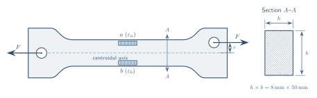

# 北京航空航天大学实验报告

- 实验名称：偏心拉伸实验
- 理论课教师：指导教师
- 学号：<请填写>
- 班级：<请填写>
- 姓名：<请填写>
- 同组者：<请填写>
- 日期：第 11 周周四下午第 8、9 节

## 一、实验目的

1. 测量试件在偏心拉伸时截面上的最大正应变 $\varepsilon_{\max}$。
2. 测定试件材料的弹性模量 $E$。
3. 测定试件的偏心距 $e$。

## 二、实验设备与仪器

1. 微机控制电子万能试验机。
2. 电阻应变仪。
3. 游标卡尺。

## 三、试件

不锈钢矩形截面试件，实验计算采用的名义尺寸为

$$
h\times b=(8\times50)\ \mathrm{mm^2}。
$$

图 1　偏心拉伸试件及应变片布置示意图。右端载荷作用线与截面形心轴的距离为偏心距 $e$；$a、b$ 为试件上下边缘的轴向应变测点。

## 四、实验原理和方法

$a、b$ 两点的正应变为

$$
\varepsilon_a=\varepsilon_F+\varepsilon_M+\varepsilon_t,
\qquad
\varepsilon_b=\varepsilon_F-\varepsilon_M+\varepsilon_t。
$$

$$
\varepsilon_{\max}=\varepsilon_F+\varepsilon_M,
\qquad
E=\frac{F}{A\varepsilon_F},
\qquad
e=\frac{\varepsilon_MW_zE}{F}。
$$

### 1. 测最大正应变 $\varepsilon_{\max}$

用半桥测量：

$$
\varepsilon_{\max}=\varepsilon_F+\varepsilon_M
=(\varepsilon_F+\varepsilon_M+\varepsilon_t)-\varepsilon_t
=\varepsilon_a-\varepsilon_t。
$$

### 2. 测拉伸正应变 $\varepsilon_F$

用全桥测量：

$$
\begin{aligned}
\varepsilon_F
&=\frac12\left[(\varepsilon_F+\varepsilon_M+\varepsilon_t)
-\varepsilon_t-\varepsilon_t
+(\varepsilon_F-\varepsilon_M+\varepsilon_t)\right]\\
&=\frac12(\varepsilon_a-\varepsilon_t-\varepsilon_t+\varepsilon_b)。
\end{aligned}
$$

### 3. 测偏心距 $e$

用半桥测量：

$$
\begin{aligned}
\varepsilon_M
&=\frac12\left[(\varepsilon_F+\varepsilon_M+\varepsilon_t)
-(\varepsilon_F-\varepsilon_M+\varepsilon_t)\right]\\
&=\frac12(\varepsilon_a-\varepsilon_b)。
\end{aligned}
$$

---

为了减小实验误差，实验采用 4 次重复加载的方法：

$$
F_0=2\ \mathrm{kN},\qquad
F_{\max}=32\ \mathrm{kN},\qquad
\Delta F=30\ \mathrm{kN},\qquad
N=4。
$$

## 五、实验原始数据记录

### 1. 四分之一桥

单位：$10^{-6}$。

| 应变 | 1 | 2 | 3 | 4 | 平均 |
|---|---:|---:|---:|---:|---:|
| $\varepsilon_a$ | 1296 | 1290 | 1294 | 1291 | 1293 |
| $\varepsilon_b$ | -522 | -521 | -519 | -518 | -520 |

### 2. 全桥

| 应变 | 1 | 2 | 3 | 4 | 平均 |
|---|---:|---:|---:|---:|---:|
| $2\varepsilon_F/10^{-6}$ | 773 | 772 | 772 | 771 | 772 |

### 3. 半桥

| 应变 | 1 | 2 | 3 | 4 | 平均 |
|---|---:|---:|---:|---:|---:|
| $2\varepsilon_M/10^{-6}$ | -1824 | -1821 | -1823 | -1819 | -1822 |

## 六、实验数据处理

### 1. 测量最大正应变

$$
\varepsilon_{\max}=\varepsilon_a=1.293\times10^{-3}。
$$

最大正应力增量为

$$
\Delta\sigma_{\max}
=E\varepsilon_{\max}
=194.3\times10^9\times1.293\times10^{-3}
=251.2\ \mathrm{MPa}。
$$

### 2. 测量弹性模量 $E$

$$
2\varepsilon_F=772\times10^{-6}
\quad\Rightarrow\quad
\varepsilon_F=3.86\times10^{-4}。
$$

由

$$
\varepsilon_F=\frac{\Delta F}{EA}
$$

得

$$
E=\frac{\Delta F}{\varepsilon_FA}
=\frac{30\times10^3}
{3.86\times10^{-4}\times(50\times8)\times10^{-6}}
=194.3\ \mathrm{GPa}。
$$

### 3. 测量偏心距 $e$

$$
2\varepsilon_M=-1.822\times10^{-3}
\quad\Rightarrow\quad
\varepsilon_M=-9.11\times10^{-4}。
$$

$$
W_z=\frac16hb^2
=\frac16\times8\times10^{-3}\times(50\times10^{-3})^2
=3.33\times10^{-6}\ \mathrm{m^3}。
$$

由

$$
\varepsilon_M=\frac{Fe}{EW_z}
$$

得

$$
e=\left|\frac{\varepsilon_MEW_z}{\Delta F}\right|
=\left|\frac{-9.11\times10^{-4}\times194.3\times10^9\times3.33\times10^{-6}}
{30\times10^3}\right|
=0.019667\ \mathrm{m}=19.67\ \mathrm{mm}。
$$

## 七、实验结论

四次重复加载的应变读数稳定。实验测得最大正应变为 $1.293\times10^{-3}$，相应的最大正应力增量为 $251.2\ \mathrm{MPa}$；材料弹性模量为 $194.3\ \mathrm{GPa}$，偏心距为 $19.67\ \mathrm{mm}$。两侧应变一拉一压，说明偏心拉力在截面上同时产生轴力和弯矩。

## 八、思考题

1. 单向偏心拉伸截面上同时存在轴力 $F$ 和弯矩 $M=Fe$。
2. 全桥法测量 $\varepsilon_F$ 的精度较高。全桥能直接消除弯曲应变和温度应变的影响，并使有效桥臂的输出叠加；若用 $\varepsilon_F=\varepsilon_{\max}-\varepsilon_M$ 间接求取，则两次测量的误差会在相减过程中共同传递到结果中。

---

## 附：原始记录页

$$
F_0=2\ \mathrm{kN},\qquad
F_{\max}=32\ \mathrm{kN},\qquad
\Delta F=30\ \mathrm{kN},\qquad
n=4。
$$

| 四分之一桥 $\varepsilon_a$ | 1296 | 1290 | 1294 | 1291 |
|---|---:|---:|---:|---:|
| 四分之一桥 $\varepsilon_b$ | -522 | -521 | -519 | -518 |

全桥：773，772，772，771。

半桥：-1824，-1821，-1823，-1819。

---
