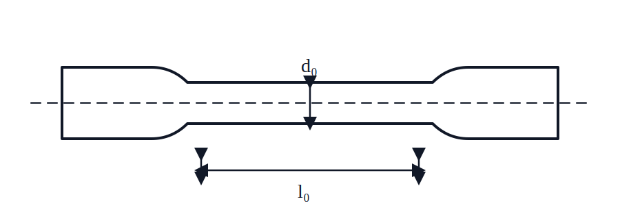
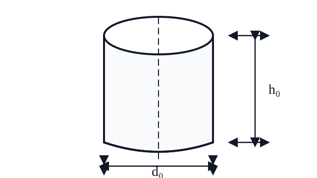
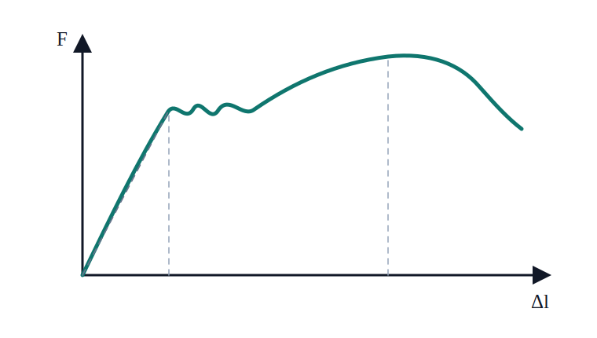
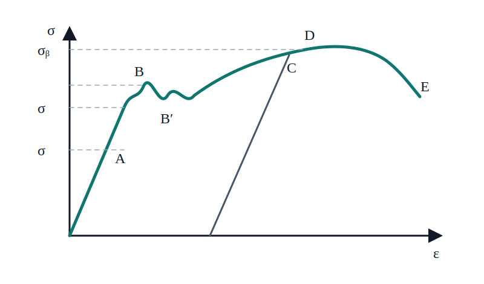
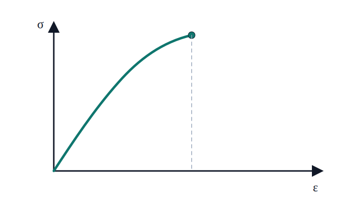
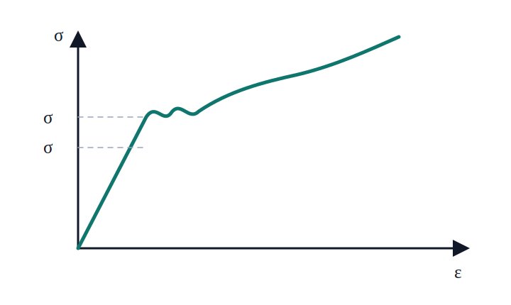
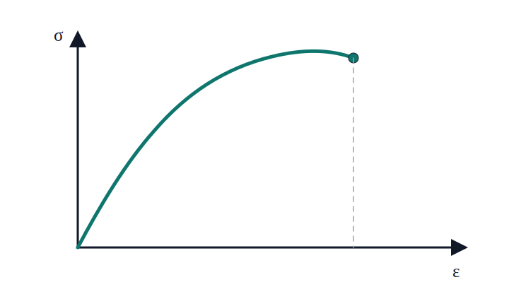

# 北京航空航天大学实验报告

- 实验名称：材料在轴向拉伸、压缩和扭转时的力学性能
- 理论课教师：指导教师
- 学号：<请填写>
- 班级：<请填写>
- 姓名：<请填写>
- 同组者：<请填写>
- 日期：2024.3.7，下午第 6、7 节

## 一、实验目的

1. 观察低碳钢试件和铸铁试件在轴向拉伸时的各种现象，得到试验力—位移曲线，并确定低碳钢材料的屈服极限、强度极限、延伸率和断面收缩率，确定铸铁材料的强度极限。
2. 观察低碳钢试件和铸铁试件在轴向压缩时的各种现象，得到试验力—位移曲线，并确定低碳钢材料的屈服极限、强度极限，确定铸铁材料的强度极限。
3. 观察低碳钢试件和铸铁试件在扭转时的各种现象，得到扭矩—转角曲线，并确定低碳钢材料的屈服极限、强度极限，确定铸铁材料的强度极限。
4. 掌握微机控制电子万能试验机的操作方法。

## 二、实验设备与仪器

50 kN 微控电子万能试验机，300 kN 微控电子万能试验机，1000 N·m 微控扭转试验机，划线机，游标卡尺。

## 三、实验试件

拉伸试件采用国家标准 GB 6397—86 中规定的长比例试件，试验段直径

$$
d_0=10\ \mathrm{mm},
\qquad
l_0=100\ \mathrm{mm}。
$$

**图一　拉伸试件示意图**

压缩试件为圆柱形试件。本次原始记录中，低碳钢与铸铁试件的实测初始尺寸分别为

$$
d_0=10.02\ \mathrm{mm},\quad h_0=15.03\ \mathrm{mm};
\qquad
d_0=9.95\ \mathrm{mm},\quad h_0=15.13\ \mathrm{mm}。
$$

**图二　压缩试件示意图**

扭转试件按国家标准 GB 6397—86 制作，试验段直径

$$
d_0=10\ \mathrm{mm},
\qquad
l_0=50\ \mathrm{mm}。
$$

拉伸试件和压缩试件的结构分别如图一、图二所示。

## 四、实验原理和方法

### 1. 低碳钢的拉伸试验

实验时，首先将试件安装在试验机的上下夹头内，然后开动试验机，缓慢加载。同时，与试验机相联的微机会自动绘制出载荷—变形曲线（$F-\Delta l$ 曲线）或应力—应变曲线（$\sigma-\varepsilon$ 曲线）。随着载荷逐渐增大，材料呈现出不同的力学性能。

**图三　低碳钢拉伸载荷—变形曲线**

**图四　低碳钢拉伸应力—应变曲线**

拉伸过程分为以下阶段：

1. **弹性阶段**：拉伸初始阶段，$\sigma-\varepsilon$ 曲线为一直线，$\sigma$ 与 $\varepsilon$ 成正比，满足胡克定律。弹性段最高点称为材料的比例极限，斜率为材料的弹性模量 $E$。若在此阶段卸载，应力—应变曲线沿原曲线返回，载荷降到 0 时，变形也完全消失。
2. **屈服阶段**：超过比例极限之后，应力与应变不再成正比。当载荷增加到一定值时，应力几乎不变，只是在某一较小范围内上下波动，而应变有急剧增长。这种现象称为屈服，材料发生屈服时的应力称为屈服应力或屈服极限 $\sigma_s$。有两个特征点：上屈服点和下屈服点；工程上通常采用下屈服点。当材料屈服时，试件表面会出现与轴线成约 $45^\circ$ 的斜纹，这是由于 $45^\circ$ 方向的最大切应力引起的，故称滑移线。
3. **硬化阶段**：经过屈服阶段后，应力—应变曲线上升，材料抵抗变形的能力又增强，这种现象称为应变硬化。若在此阶段卸载，应力—应变曲线为直线，斜率与比例阶段大致相等。应力减小为 0 时，变形称为残余应变，消失的应变为弹性应变。在卸载后重新加载，比例极限得到提高，这一现象称为冷作硬化。在硬化阶段，应力—应变曲线存在一最高点，对应应力称为材料的强度极限。
4. **缩颈阶段**：试样拉伸达到强度极限之后，试样出现局部显著收缩，称为缩颈。缩颈出现后，所需载荷减小，直至断裂。断口呈杯状，说明由拉应力与切应力共同作用。

### 2. 铸铁的拉伸试验

铸铁的拉伸力学性能明显不同于低碳钢，其应力—应变曲线从开始受力至断裂，变形始终很小，无屈服，也无缩颈；断口垂直于试样轴线。导致破坏的原因是最大拉应力。

**图五　铸铁拉伸曲线**

### 3. 低碳钢和铸铁的压缩性能试验

实验时，首先将试件放置于试样机的平台上，开动试验机，缓慢加载。同时，与试验机相连的数据显示系统会自动绘制出 $F-\Delta l$ 曲线或 $\sigma-\varepsilon$ 曲线。

低碳钢试件在压缩初期，应力与应变成正比，满足胡克定律；达到屈服后，塑性变形迅速增大。由于试件端面与压板之间存在摩擦，试件中部横向变形较大，逐渐形成腰鼓形，一般不会发生断裂破坏。

**图六　低碳钢压缩曲线**

铸铁试件在压缩过程中，无明显弹性阶段、屈服阶段，其压缩极限为拉伸极限的 3～4 倍；断口方向与试件方向约成 $55^\circ$，一般认为是切应力与摩擦力共同作用的结果。

**图七　铸铁压缩曲线**

### 4. 低碳钢和铸铁的扭转实验

实验时，首先将试件安装在扭转试验机的左右夹头内，并在试件表面划一条直线，以观察试件变形。然后开动试验机，缓慢加载，同时自动绘制扭矩—转角曲线。

低碳钢受扭初期，扭矩与转角成正比，满足扭转胡克定律。达到屈服后，转角显著增大；随后材料出现一定的强化，试件经较大塑性扭转后，沿垂直于轴线的横截面被剪断，说明其破坏主要由切应力引起。

铸铁受扭时变形很小，通常在较小转角下突然断裂，破坏面为与轴线成约 $45^\circ$ 的螺旋面，说明其破坏主要由最大拉应力引起。

---

第 1～3 页原图

## 五、实验数据记录与数据处理

### 1. 原始数据记录

#### 低碳钢拉伸试件截面直径

| 测量位置 | 横向 1/mm | 横向 2/mm | 横向 3/mm | 纵向 1/mm | 纵向 2/mm | 纵向 3/mm |
|---|---:|---:|---:|---:|---:|---:|
| 左端 | 10.00 | 10.01 | 10.04 | 10.02 | 9.99 | 9.98 |
| 中间 | 10.00 | 10.02 | 10.03 | 10.02 | 10.02 | 9.99 |
| 右端 | 9.97 | 9.97 | 9.97 | 9.96 | 9.97 | 9.99 |

原稿给出的平均直径：

$$
d_0=10.00\ \mathrm{mm}。
$$

#### 标距

| $l_0$/mm | 1 | 2 | 3 | 平均 |
|---|---:|---:|---:|---:|
| 测量值 | 99.91 | 99.89 | 99.93 | 99.91 |

#### 断裂直径

| 断裂直径/mm | 1 | 2 | 3 | 平均 |
|---|---:|---:|---:|---:|
| 测量值 | 6.03 | 6.19 | 6.18 | 6.13 |

#### 断裂标距

| 断裂标距/mm | 1 | 2 | 3 | 平均 |
|---|---:|---:|---:|---:|
| 测量值 | 130.87 | 129.98 | 130.97 | 130.61 |

下表为**低碳钢轴向拉伸实验**由试验机载荷—变形曲线读取的特征载荷；$F_s$ 为屈服载荷，$F_p$ 为峰值载荷。

| 实验 | 特征量 | 符号 | 实测值/kN |
|---|---|---:|---:|
| 低碳钢轴向拉伸实验 | 屈服载荷 | $F_s$ | 24.520 |
| 低碳钢轴向拉伸实验 | 峰值载荷 | $F_p$ | 35.250 |

### 2. 低碳钢拉伸数据处理

初始截面积：

$$
A_0=\frac{\pi d_0^2}{4}
=\frac{\pi(10.00\times10^{-3})^2}{4}
=78.5398\times10^{-6}\ \mathrm{m^2}。
$$

断后最小截面积：

$$
A_1=\frac{\pi d_1^2}{4}
=\frac{\pi(6.13\times10^{-3})^2}{4}
=29.5128\times10^{-6}\ \mathrm{m^2}。
$$

屈服极限：

$$
\sigma_s
=\frac{F_s}{A_0}
=\frac{24.520\times10^3}{78.5398\times10^{-6}}
=312.20\ \mathrm{MPa}。
$$

强度极限：

$$
\sigma_b
=\frac{F_p}{A_0}
=\frac{35.250\times10^3}{78.5398\times10^{-6}}
=448.82\ \mathrm{MPa}。
$$

延伸率：

$$
\delta
=\frac{l_1-l_0}{l_0}\times100\%
=\frac{(130.61-99.91)\times10^{-3}}{99.91\times10^{-3}}\times100\%
=30.73\%。
$$

断面收缩率：

$$
\psi
=\left|\frac{A_0-A_1}{A_0}\right|\times100\%
=\left|\frac{d_0^2-d_1^2}{d_0^2}\right|\times100\%
=\left|\frac{(10.00\times10^{-3})^2-(6.13\times10^{-3})^2}
{(10.00\times10^{-3})^2}\right|\times100\%
=62.42\%。
$$

### 3. 各材料与加载方式结果汇总

| 加载方式 | 材料 | 失效形式 | 典型现象 | 强度指标 | 塑性指标 |
|---|---|---|---|---|---|
| 拉伸 | 低碳钢 | 断裂 | 屈服时出现 $45^\circ$ 滑移线；有明显缩颈现象；断口呈杯形 | $\sigma_s=312.20\ \mathrm{MPa}$；$\sigma_b=448.82\ \mathrm{MPa}$ | $\delta=30.73\%$；$\psi=62.42\%$ |
| 拉伸 | 铸铁 | 断裂 | 断口垂直于轴线 | $\sigma_b=140.69\ \mathrm{MPa}$ | — |
| 压缩 | 低碳钢 | 大塑性变形 | 有弹性阶段和屈服阶段；屈服后塑性变形迅速增大，试件呈腰鼓形 | $\sigma_s=299.29\ \mathrm{MPa}$ | — |
| 压缩 | 铸铁 | 断裂 | 断口与轴线成约 $55^\circ$ | $\sigma_b=573.47\ \mathrm{MPa}$ | — |
| 扭转 | 低碳钢 | 断裂 | 塑性转角很大；断口垂直于轴线 | $\tau_b=516.07\ \mathrm{MPa}$ | $\varphi=2117.59^\circ$ |
| 扭转 | 铸铁 | 断裂 | 变形小；沿与轴线成约 $45^\circ$ 的螺旋面断裂 | $\tau_b=251.13\ \mathrm{MPa}$ | $\varphi=69.38^\circ$ |

拉伸对比：低碳钢有明显屈服、强化和缩颈，断后延伸率与断面收缩率均较大；铸铁无明显屈服和缩颈，变形很小时即沿近似垂直轴线的截面脆断。

压缩对比：低碳钢屈服后产生很大的塑性变形并形成腰鼓形，一般不发生断裂；铸铁沿约 $55^\circ$ 斜面断裂，压缩强度 $573.47\ \mathrm{MPa}$ 约为其拉伸强度 $140.69\ \mathrm{MPa}$ 的 4.08 倍。

扭转对比：低碳钢扭转角很大，最终沿垂直轴线的横截面剪断；铸铁扭转角较小，沿与轴线约成 $45^\circ$ 的螺旋面脆断。

综上，低碳钢属于塑性材料，在三种加载方式下均表现出较明显的塑性变形；铸铁属于脆性材料，破坏前变形较小，通常无明显屈服阶段。两类材料的断口方向与相应截面上的主导应力状态相符。

---

第 4 页原图

## 六、实验结论

低碳钢拉伸试验测得 $\sigma_s=312.20\ \mathrm{MPa}$、$\sigma_b=448.82\ \mathrm{MPa}$、$\delta=30.73\%$、$\psi=62.42\%$，表现出明显的屈服、强化和缩颈过程。低碳钢在压缩和扭转时也具有较大的塑性变形；铸铁在三种加载方式下均表现出脆性特征。各断口形貌与相应截面上的主导应力状态基本一致。

## 七、思考题

### 1. 低碳钢和铸铁在不同加载方式下的断口与应力

- 低碳钢拉伸：断口杯形，正应力与切应力共同作用。
- 低碳钢扭转：断面垂直轴线，切应力作用。
- 铸铁拉伸：断面垂直轴线，正应力作用。
- 铸铁压缩：约 $55^\circ$ 断面，切应力与摩擦力共同作用。
- 铸铁扭转：沿与轴线成约 $45^\circ$ 的螺旋面断裂，主要由最大拉应力引起。

### 2. 延伸率与标距

$$
\delta
=\left|\frac{l_1-l_0}{l_0}\right|
=\frac{\Delta l}{l_0}\times100\%。
$$

从开始加载至断裂，$\Delta l$ 与 $l_0$ 不成线性关系，且

$$
2\Delta l_{5d_0}>\Delta l_{10d_0},
\qquad
\delta_{5d_0}>\delta_{10d_0}。
$$

### 3. 卸载后的残余应变和弹性应变

由卸载直线与应变轴的交点可读出残余应变 $\varepsilon_p$；卸载过程中恢复的应变为弹性应变 $\varepsilon_e$。在卸载起点的总应变中，二者满足 $\varepsilon=\varepsilon_p+\varepsilon_e$。

---

第 5 页原图（原始记录）

## 附：第 5 页其他原始记录

- 低碳钢拉伸截面直径（横向/纵向）：10.00/10.02，10.01/9.99，10.04/9.98。
- 低碳钢拉伸其他测量：10.00/10.02，10.02/10.02，10.03/9.99；9.97/9.96，9.97/9.97，9.97/9.99。
- 标距 $l_0$：99.91，99.89，99.93 mm。
- 断后标距：130.87，129.98，130.97 mm。
- 断后直径：6.03，6.19，6.18 mm。
- 铸铁扭转：$\varphi=69.38^\circ$，$T_{\max}=49.31\ \mathrm{N\cdot m}$。
- 低碳钢扭转：$\varphi=2117.59^\circ$，$T_{\max}=101.33\ \mathrm{N\cdot m}$。
- 压缩实验低碳钢：$h_0=15.03\ \mathrm{mm}$，$d_0=10.02\ \mathrm{mm}$，$F_b=197.15\ \mathrm{kN}$，$F_s=23.6\ \mathrm{kN}$，$h_1=4.95\ \mathrm{mm}$，$d_1=17.70\ \mathrm{mm}$。
- 压缩实验铸铁：$h_0=15.13\ \mathrm{mm}$，$d_0=9.95\ \mathrm{mm}$，$F_b=60.81\ \mathrm{kN}$，$55^\circ$ 断口，$h_1=12.64\ \mathrm{mm}$，$d_1=11.62\ \mathrm{mm}$。
